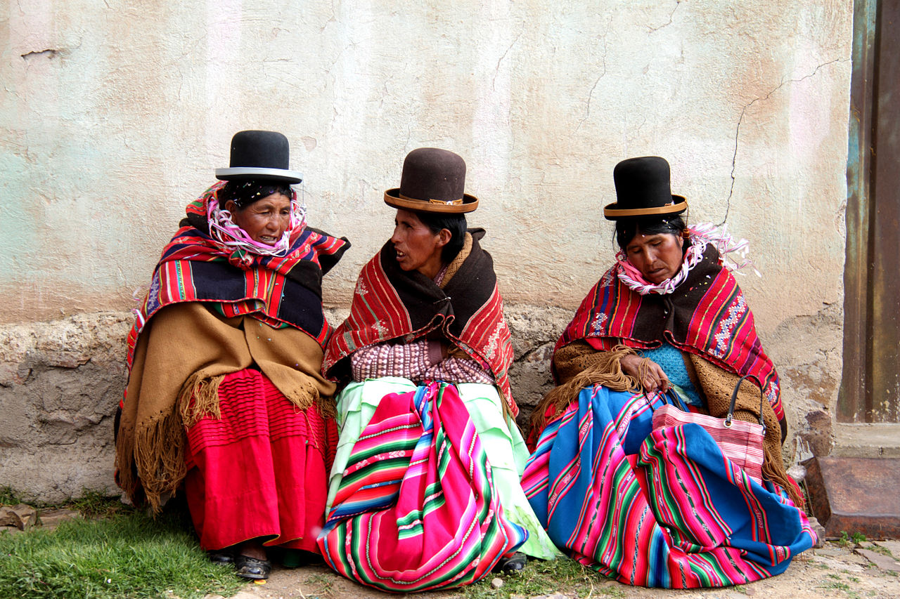
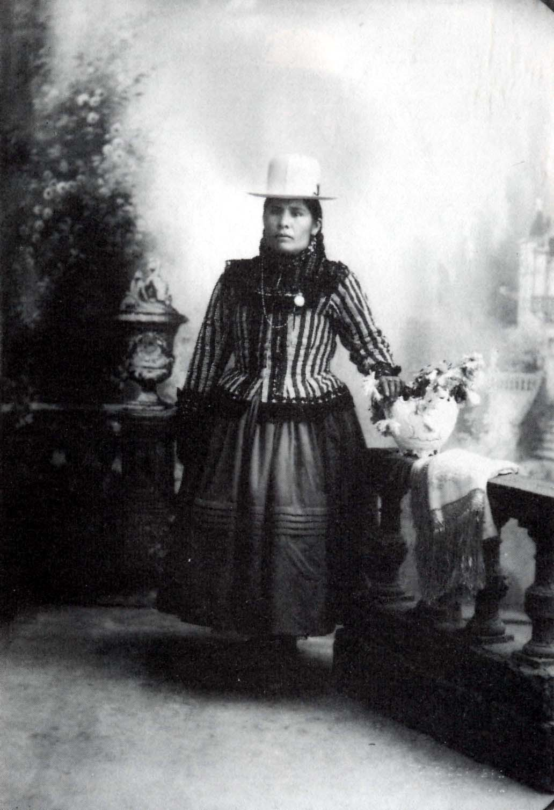
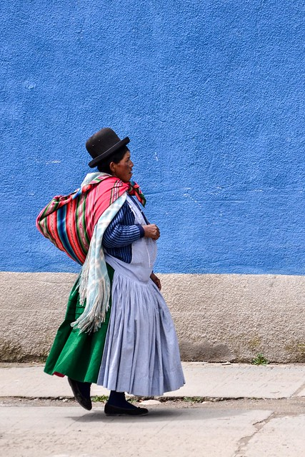
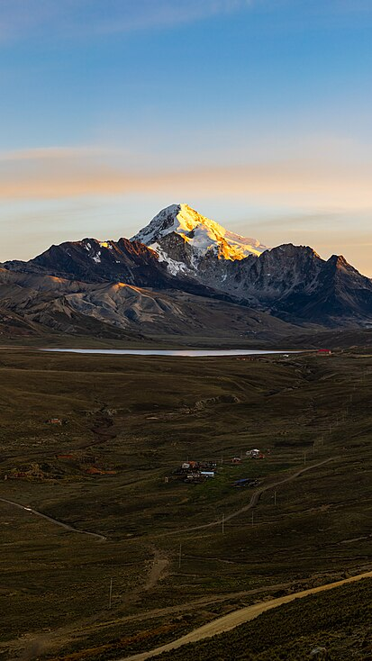
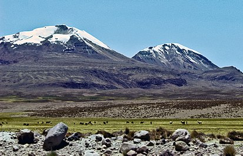
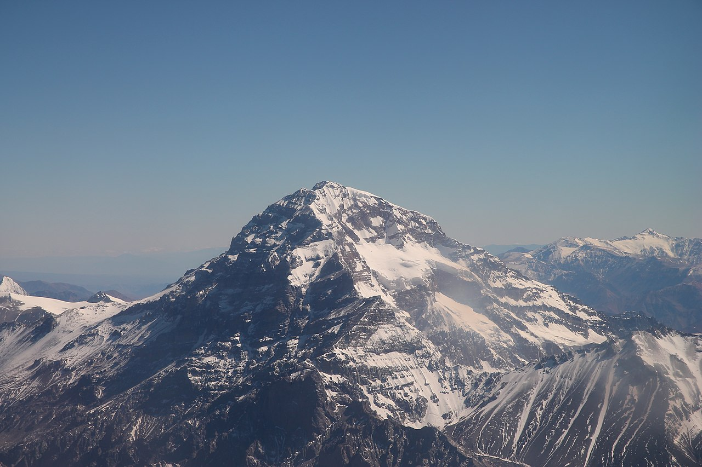
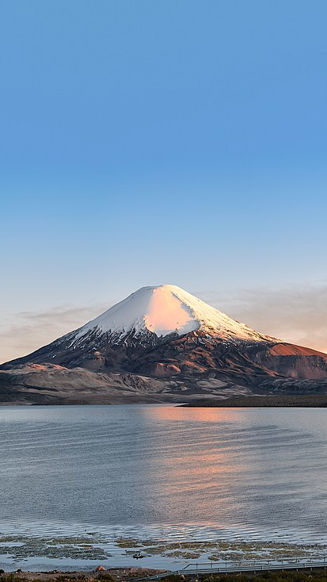
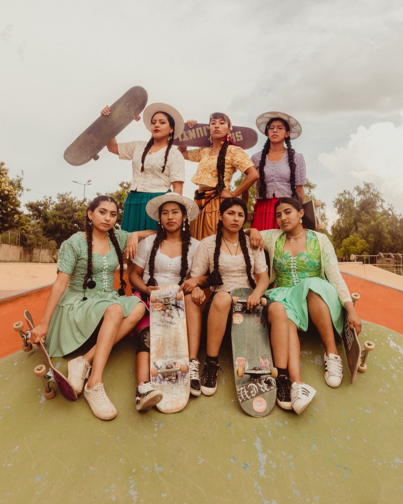

```{r, echo = FALSE, message=FALSE, eval=FALSE}

names(xaringan:::list_css())
```

```{r echo=FALSE, fig.align='center', message=FALSE, out.width="40%"}



```
# Orígenes de las cholitas

## ¿Quienés son las cholitas?

Son mujeres bolivianas de origen indígena (aymara y quechua).

- "Chola" es un término comúnmente usado para designar a las mujeres indígenas bolivianas, principalmente a las aymara. Sin embargo, el término se ha transformado en sinónimo de mestizaje.

- La vestimenta tiene influencia de la colonización.

- En el siglo XVI, el colonizador español Diego Cabeza de Vaca introdujo la idea de que las mujeres indígenas debían vestirse con trajes semejantes a la moda europea.


---

# Vestimenta y identidad

1. La decente o chola de primera (que tiene una buena condición financera)
***
```{r,  echo=FALSE, fig.align='center', message=FALSE, out.width="40%" }

```

---
2. La chola mediana o de segunda (comerciante)
***
```{r,echo=FALSE, fig.align='center', message=FALSE, out.width="50%"}
knitr::include_graphics("./imagens/cholita_de_segunda.avif")
```

---
3. La india o campesina
***
```{r,echo=FALSE, fig.align='center', message=FALSE, out.width="40%"}

```

---
# Composición de la vestimenta

- Sombrero Borsalino o Bombín: Un sombrero pequeño, redondeado y rígido que se lleva ligeramente inclinado. Puede ser de fieltro y de colores variados. La manera en que se lleva puede tener significados culturales y sociales.

- Manta: También llamada "aguayo" en algunas regiones, es una pieza de tejido rectangular que se lleva sobre los hombros. Las mantas suelen tener colores vivos y patrones tradicionales y pueden ser usadas para cargar objetos o bebés en la espalda.

- Blusa: Las blusas son generalmente de colores vivos, con encajes y bordados decorativos. Suelen ser de manga larga y a veces tienen detalles en los puños y el cuello.

- Pollera: Es una falda amplia y voluminosa que llega hasta los tobillos. Las polleras son generalmente de tela pesada y pueden tener varias capas. Son adornadas con encajes y bordados, y a menudo son de colores brillantes.

- Enagua: Es una especie de falda interior que se usa debajo de la pollera para darle volumen adicional.

- Chaleco o Torera: En algunas regiones, las cholitas también usan un chaleco ajustado sobre la blusa.


---
# La resignificación de la tradición: Las cholitas escaladoras. 

> _Las Cholitas Escaladoras es el nombre con el que se conoce un grupo de mujeres bolivianas. Creado en el año 2015 e integrado por 14 mujeres con edades que van entre los 13 y 55 años que se propusieron retar los caminos que se suponían exclusivos de los hombres._ (Esquivel, p. 134, 2023)

***

## ¿Quienés son las cholitas escaladoras?

```{r,echo=FALSE, out.width="25%", fig.align="center"}
knitr::include_graphics("./imagens/cholitas_escaladora.avif")
```


- Tienen entre 50 y 24 años.
- Antes de se tornar escaladoras las cholitas eran cocineras o porteadoras  en acampamentos de montañas. 
- Han empenzado a escalar hacia 2015.

Integrantes: Lidia Huayllas Estrada (la líder), Cecilia Llusco Alaña, Teodora Magueño Machaca, Analía Gonzales Magueño, Elena Quispe Tincuta.


---
# Las montañas que escalaran

. **Huayna Potosí** (2015)

```{r, echo=FALSE, out.width="15%", fig.align="center", fig.cap="altura: 6090 m s. n. m. (metros sobre el nivel del mar)"}

```


. **Cerro Acotango**

```{r,  echo=FALSE, out.width="30%", fig.align="center", fig.cap="altura: 6.050 metros"}


```

---

. **Mendonza**

> la cumbre más alta del hemisferio occidental

```{r, fig.cap="6.962 metros sobre el nivel del mar, y el Sur, de 6.930 metros sobre el nivel del mar", echo=FALSE, out.width="30%", fig.align="center"}



```


. **Parinacota**


```{r, fig.cap="6.350 metros", echo=FALSE, out.width="15%", fig.align="center"}

```

---
# Las cholitas escaladoras han inspirado otras cholitas a explorar nuevas ocupaciones

- Las cholitas luchadoras
***
```{r, echo=FALSE, out.width="30%", fig.align="center"}
knitr::include_graphics("./imagens/cholitas-luchando.avif")
```


- Las cholitas skatistas
***
```{r, echo=FALSE, out.width="23%", fig.align="center"}

```


---
Sus redes sociales 

[Instagram Cholitas Escaladoras](https://www.instagram.com/cholitasescaladoras/)

[Instagram Cholitas Luchadoras](https://www.instagram.com/cholitas_wrestling/)

[Instagram Cholitas Skatistas](https://www.instagram.com/imillaskate/?hl=pt)

---
Referencias

CHOLITAS ESCALADORAS. In:  WIKIPEDIA, LA ENCICLOPEDIA LIBRE. [S. l.: s. n.], 2024. Disponível em: https://es.wikipedia.org/w/index.php?title=Cholitas_escaladoras&oldid=159008428. Acesso em: 6 jun. 2024.

VILCHIS ESQUIVEL, Luz del Carmen A. Las cholitas escaladoras y sus relaciones con el universo hipermedial. Cuadernos del Centro de Estudios en Diseño y Comunicación. Ensayos, [s. l.], n. 202, p. 131–143, 2023. Disponível em: https://dialnet.unirioja.es/servlet/articulo?codigo=9268890. Acesso em: 6 jun. 2024.


